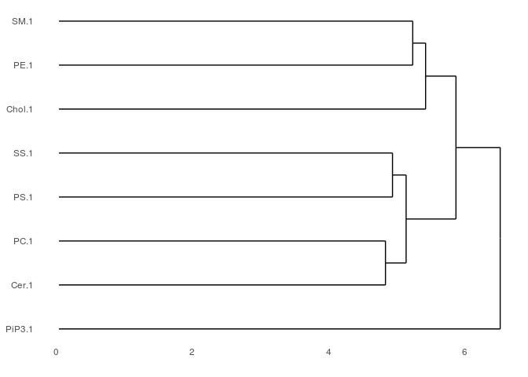

EL4\_lipid\_pullDown
================
Xuerui Huang
5/5/2019

-   [Load requried package](#load-requried-package)
-   [Load Data](#load-data)
-   [DEseq](#deseq)
-   [Plot result](#plot-result)
    -   [Count](#count)
    -   [Plot histogram](#plot-histogram)
    -   [Plot heatmap](#plot-heatmap)

Load requried package
=====================

``` r
library(DESeq2)
library(stringr)
library(ggplot2)
library(ggpubr)
library(dplyr)
library(tidyverse)
library(reshape2)
library("grid")

source("~/dataOS/CS_RNA/Functions.R")
```

Load Data
=========

``` r
EL4_exon_count <- read.csv("/dataOS/frankyan/OTHERS/lipid_RNA/Results/pipeOutput/mm_lipidRNA-L1_2/countsTable/mm_lipidRNA-L1_2.EX.counts.table",sep = "\t")
EL4_exon_count[,1] <- gsub("\\..*","", EL4_exon_count[,1])
```

DEseq
=====

``` r
#format table
EL4_count <- EL4_exon_count[,c(1,7:ncol(EL4_exon_count))]
EL4_count <- column_to_rownames(EL4_count,"Geneid")

#Output candidate genes (in files) for each set of comparison
#Output a merged result for ENSELBl and gene_SYMBL
#Used pvalue instead of padj
OutputVec_ENSEMBL <- c()
OutputVec_SYMBOL <- c()
for (i in seq(3, ncol(EL4_count), by=2)){
  temp_df <- EL4_count[c(i,i+1,1,2)]
  temp_DEres_df <- perform_DEseq(temp_df,2,2)
  outputFileName <- gsub("_.*","",colnames(EL4_count)[i]) %>% paste0(.,"_cands.csv")
  temp_cand <- get_DEgenes_info(temp_DEres_df,2,0.5,anno_info_Mm,outputFileName)
  OutputVec_ENSEMBL <- c(OutputVec_ENSEMBL, temp_cand$Gene_name %>% as.data.frame(.))
  OutputVec_SYMBOL <- c(OutputVec_SYMBOL,temp_cand$SYMBOL %>% as.data.frame(.))
}

#get output colnames
File_title <- gsub("_.*","",colnames(EL4_count))[seq(3,ncol(EL4_count), by=2)]

#Format output res into dataframe
Op_ENSEMBL <- sapply(OutputVec_ENSEMBL, '[', seq(max(sapply(OutputVec_ENSEMBL, length)))) %>% 
  as.data.frame(.) %>% set_colnames(.,File_title)
Op_SYMBOL <- sapply(OutputVec_SYMBOL, '[', seq(max(sapply(OutputVec_SYMBOL, length)))) %>% 
  as.data.frame(.) %>% set_colnames(.,File_title)
```

Plot result
===========

Count
-----

``` r
#Get all the genes
Uni_gene <- c()
for (i in c(1:ncol(Op_SYMBOL))){
  Uni_gene <- c(Uni_gene,Op_SYMBOL[,i] %>% .[!is.na(.)] %>% as.vector(.))
}

#gene cands duplicated occured genes
dup_genes <- table(Uni_gene) %>% as.data.frame(.) %>% subset(.,.$Freq>4) %>% .[order(-.$Freq),]
dup_genes_names <- dup_genes$Uni_gene %>% as.vector(.)
dup_genes_names[1:10]
```

    ##  [1] "Cry1"     "Mgat2"    "Naip2"    "Pole4"    "Smarcb1"  "Utp11"   
    ##  [7] "Ankrd50"  "Apba1"    "BC004004" "Cnn2"

Plot histogram
--------------

``` r
pass_filter_count <- c()
for (i in c(seq(1,8))){
  cc <- length(which(table(Uni_gene) %>% as.data.frame(.) %>% .$Freq >= i))
  pass_filter_count <- c(pass_filter_count,cc)
}

pass_filter_count_df <- cbind(c(seq(1,8)),pass_filter_count) %>% as.data.frame(.) %>% 
  set_colnames(.,c("Freq_thresh","Count"))

pp_bar <- ggplot(pass_filter_count_df,aes(x = factor(Freq_thresh),y = Count))+
  geom_bar(stat="identity", fill="steelblue")+theme_minimal()+
  geom_text(aes(label=Count), vjust=-0.1, color="black", size=4.5,face="bold")+
  xlab("Occur_Freq_thresh")+ggtitle("Count of Genes Across Different Num of Samples")+
  theme(text = element_text(size = 18,face="bold"),
        axis.text.x = element_text(size = 18,face="bold",hjust=.1),
        axis.text.y = element_text(size = 18),
        plot.title = element_text(size=15,face="bold"),
        legend.position = "top")
```

    ## Warning: Ignoring unknown parameters: face

``` r
ggsave("Bar_occur.png",pp_bar,height = 6 , width = 10)
```

Plot heatmap
------------

``` r
#get count df for count occurace of genes in each file, 1==occur, 0==not occur
ct_all <- c()
for (i in c(1:length(File_title))){
  ct_occur <- c()
  for (gene in dup_genes_names){
    if (gene %in% Op_SYMBOL[,i]){
      ct_occur <- c(ct_occur,1)
    } 
    else{
      ct_occur <- c(ct_occur,0)
    }
  }
  ct_all <- c(ct_all,as.data.frame(ct_occur))
}

count_df <- cbind(dup_genes_names,as.data.frame(ct_all)) %>% as.data.frame(.) %>% set_colnames(.,c("SYMBOL",File_title))

# Run clustering
count_matrix <- as.matrix(t(count_df[,c(2:ncol(count_df))]))
rownames(count_matrix) <- File_title
dendro <- hclust(d = dist(x = count_matrix))

File_title
```

    ## [1] "Cer.1"  "Chol.1" "PC.1"   "PE.1"   "PS.1"   "PiP3.1" "SM.1"   "SS.1"

``` r
File_title[dendro$order]
```

    ## [1] "PiP3.1" "Cer.1"  "PC.1"   "PS.1"   "SS.1"   "Chol.1" "PE.1"   "SM.1"

``` r
#plot dendrogram
require("ggdendro")
```

    ## Loading required package: ggdendro

``` r
count_dendro <- as.dendrogram(dendro)
dendro.plot <- ggdendrogram(data = count_dendro, rotate = TRUE)
# Preview the plot
print(dendro.plot)
```



``` r
#adjust plot order
count_df_melt <- melt(count_df)
```

    ## Using SYMBOL as id variables

``` r
count_df_melt$SYMBOL <- factor(count_df_melt$SYMBOL,levels =dup_genes_names)
count_df_melt$variable <- factor(count_df_melt$variable,levels = File_title[dendro$order])

#plot
pp <- ggplot(count_df_melt,aes(x=SYMBOL,y = variable,fill=factor(value)))+
  geom_tile()+ scale_fill_manual(values=c("lightblue","steelblue"),name = "Appear",
                                 label=c("Not Occur","Occur"))+
  theme_minimal()+ggtitle("Scatter Plot of Ocurrence of Genes")+
  theme(text = element_text(size = 18,face="bold"),
        axis.text.x = element_text(size = 4.5,face="bold",angle=-45,hjust=.1),
        axis.text.y = element_text(size = 18),
        plot.title = element_text(size=15,face="bold"),
        legend.position = "top")

#show plot
pp
```


``` r
#save plot with dandogram
png("scatterPlot_4.png", width = 9,height = 5,units = "in",res = 1200,pointsize = 4)
grid.newpage()+
  print(pp, vp = viewport(x = 0.35, y = 0.5, width = 0.65, height = 1.0))+
  print(dendro.plot, vp =  viewport(x = 0.77, y = 0.46, width = 0.18, height = 0.72))
```

    ## NULL

``` r
dev.off()
```

    ## png 
    ##   2
